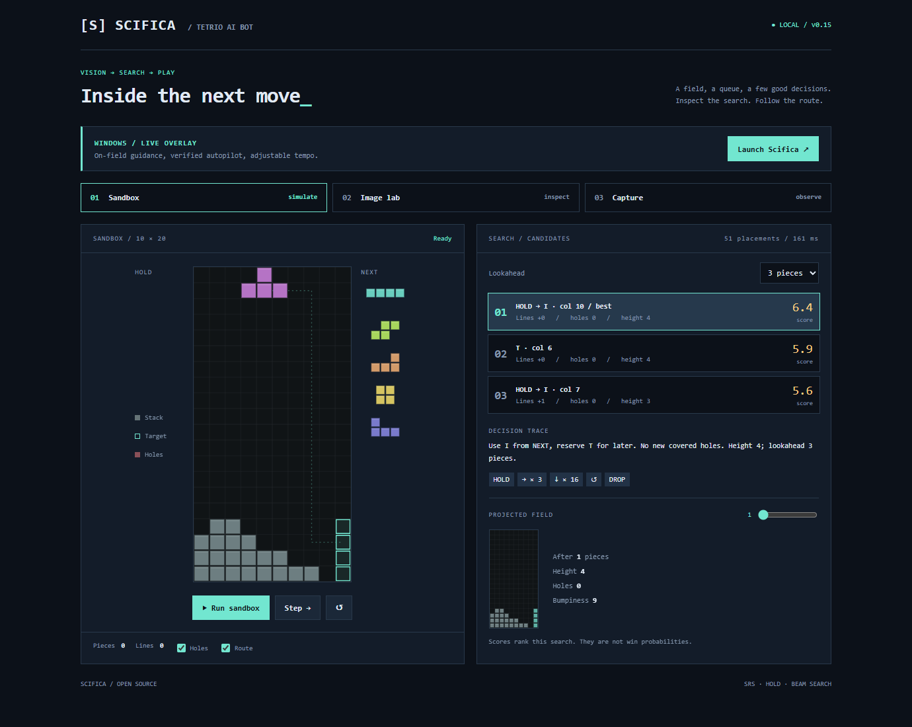
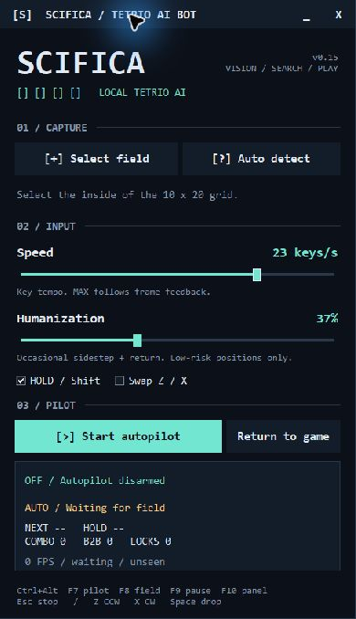
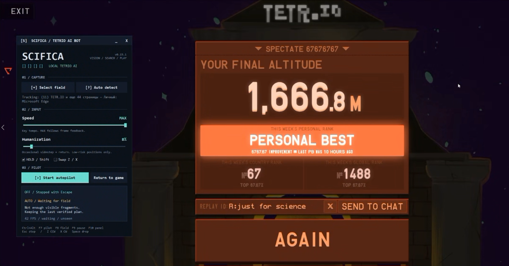
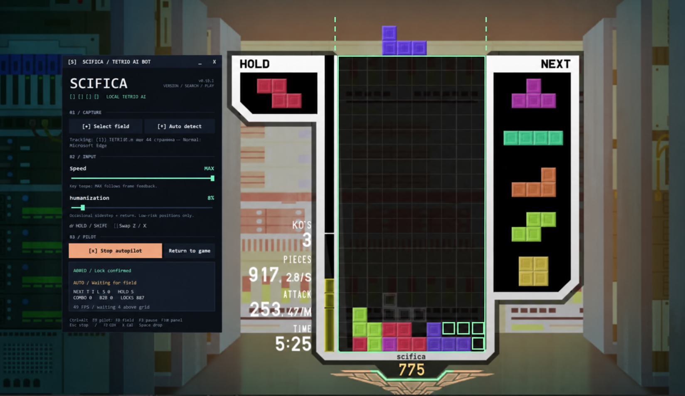

<div align="center">


# Scifica — Tetrio AI Bot

**Pixels in. A plan out. Every key checked.**

[](https://github.com/Shightrox/Scifica-Tetrio-ai-bot/actions/workflows/checks.yml)

[](LICENSE)

A local visual coach and experimental autopilot for TETR.IO.
An English terminal-style panel, a click-through overlay, and an inspectable search.

[Get started](#run-it) · [Controls](#controls) · [How it thinks](docs/architecture.md) · [Limitations](#current-limits)

</div>



The browser sandbox above runs entirely locally. The screenshot uses a synthetic field.

## The desktop pilot



- **See the field.** Direct Windows capture, four rows above spawn, NEXT and HOLD. Grid-aligned block contours help separate pieces from colorful backgrounds.
- **Plan ahead.** SRS reachability, HOLD branches, limited multi-piece search and speculative next-state caching.
- **Adapt.** Prepare quads and short clear chains when there is space; downstack when height, holes or buried garbage become dangerous.
- **Verify each key.** Observe the result of movement, HOLD and hard drop before advancing. Recover and replan after missed input, changed stacks or search-worker failure.
- **Set the tempo.** Speed adjusts key spacing; MAX adds no artificial wait. Humanization adds occasional verified lateral out-and-back moves in low-risk positions.
- **Stay in view.** Custom draggable title bar, minimize and close. The panel stays open when autopilot starts and stays put during background recalibration.

No browser extension, game-process injection, remote inference or API key is required.

## In game



User-supplied result screenshot, published unchanged. A single run, not a benchmark.



Edited illustration from a user screenshot: nickname changed to `scifica`; the capture-excluded field frame and landing outlines were reconstructed with imagegen. Small screenshot details may differ from the original. [Image provenance and edit prompt](docs/screenshots.md).

## Run it

### Windows executable

Download **`Scifica-0.15.2-windows-x64.exe`** from [Releases](https://github.com/Shightrox/Scifica-Tetrio-ai-bot/releases/latest) and run it. Python, Node.js and the native dependencies are bundled. No installer or administrator rights are needed.

Requires **64-bit Windows 10 2004+ or Windows 11**. The executable opens the desktop pilot; the optional browser sandbox remains available from source. Settings and logs live in `%LOCALAPPDATA%\Scifica`, outside the executable's temporary extraction directory. The first launch may take a few seconds to unpack.

Each release includes `SHA256SUMS.txt`, build versions and third-party license notices. See [building the EXE](docs/windows-build.md) for the reproducible build procedure.

### From source

The live overlay requires **Windows 10 2004+ or Windows 11**, **Python 3.10+ with Tcl/Tk**, and **Node.js 22+ on PATH**. Use a normal windowed or borderless game window.

```sh
git clone https://github.com/Shightrox/Scifica-Tetrio-ai-bot.git
cd Scifica-Tetrio-ai-bot
```

1. Run **`INSTALL.cmd`** once. It creates a local `.venv` and installs NumPy and Pillow.
2. Open **`OVERLAY.cmd`** for the desktop pilot. **`START.cmd`** opens the optional browser sandbox at `http://127.0.0.1:8765`.
3. Open a TETR.IO practice or private/custom game. Choose **Select field** and outline the inside of the 10 × 20 grid, or try **Auto detect**.
4. Keep the spawn area, HOLD and NEXT visible. Move the panel clear of the capture area.
5. Use **Start autopilot** or **Ctrl+Alt+F7**. Autopilot starts disarmed each launch. **Escape** stops it.

Manual setup is equivalent:

```powershell
python -m venv .venv
.venv\Scripts\python -m pip install -r requirements.txt
.venv\Scripts\python overlay.py
```

Only the Windows overlay sends game input. The browser has its own sandbox and a simpler, read-only image/capture inspector.

## Controls

| Control | Function |
| --- | --- |
| Speed: 2–29 keys/s | Nominal tap frequency; feedback can make it slower |
| Speed: MAX | No extra pacing delay; fresh-frame verification still applies |
| Humanization: 0–100% | Probability of one sidestep + return on an eligible piece; also up to ±12% timing variation below MAX |
| HOLD | Allow the search to use Shift to exchange the piece |
| Swap Z / X | Reverse the configured rotation keys |
| Return to game | Give focus back to the selected game window |
| Ctrl+Alt+F7 | Arm / stop autopilot |
| Ctrl+Alt+F8 | Select the field again |
| Ctrl+Alt+F9 | Pause / resume the coach; pauses also stop autopilot |
| Ctrl+Alt+F10 | Restore the control panel |
| Escape | Stop autopilot immediately |

Expected game bindings: **Left / Right** move, **Z** counterclockwise, **X** clockwise, **Space** hard drop, **Shift** HOLD. Match them in TETR.IO.

Humanization defaults to **0%**. Extra movement is skipped for high stacks, low clearance, inferred-only poses and recovery attempts. It never randomly drops, holds or rotates. A failed detour triggers replanning from the observed position. It is a movement-style option, not a guarantee of human-like play.

Preferences are stored in `settings.json` (beside the source, or under `%LOCALAPPDATA%\Scifica` for the EXE); capture rectangles and armed state are not persisted. Opening the panel pauses input through the focus guard. Use **Return to game** to continue. Minimizing the panel keeps the overlay running.

## How it thinks

```text
 screen region ──> cell / contour reader ──> verified board + pose
                           │                        │
                     NEXT + HOLD                    v
                           └────────────────> reachable placements
                                               │ SRS + beam search
                                               v
                                      target + executable route
                                               │
                       next frame <── verify <── tap one key
```

The fast result comes first. A deeper worker refines the choice and precomputes likely continuations. The pilot verifies every tap and checks the exact landing before hard drop. The strategic evaluator weighs clear chains, quads, perfect clears and future opportunities against holes, burial and top-out risk.

Read [the architecture notes](docs/architecture.md) for the capture model, AUTO policy, speed semantics and recovery rules.

## Current limits

- This is a visual prototype, not a complete TETR.IO simulator. Custom skins, unusual layouts, heavy effects and completely obscured pieces can still interrupt tracking.
- NEXT identifies the upcoming piece, not its current coordinates. The pilot may make a guarded early spawn move, but requires an observed pose before DROP.
- Native routes use lateral moves, 90° SRS rotations, HOLD and hard drop. T-spins/all-spins, soft-drop tucks and 180° rotations are not modeled.
- Attack values and B2B/combo rewards are approximations. Room-specific damage formulas, incoming-garbage timers and attack cancellation are not modeled. Risen garbage is detected from the field and triggers replanning.
- Search is a limited beam, not an exhaustive solution. Scores compare candidates; they are not success probabilities. Finite-speed gravity, DAS/ARR and lock-delay timing are handled through feedback rather than a full frame simulator.
- Speed is a key tempo, not pieces per second. Capture, search, the game's response and verification determine actual throughput.

## Development

```powershell
npm test
.venv\Scripts\python -m unittest discover -s tests -p "test_*.py" -v
.venv\Scripts\python tests/recovery.py
.venv\Scripts\python tests/game_input_checks.py
.venv\Scripts\python tests/vision_checks.py
.venv\Scripts\python tests/window_checks.py
```

Tests cover reachable routes, wall kicks, HOLD, combo continuations, next-piece survival, worker caching, tempo, humanization, missed keys, focus loss, garbage changes, notification masks and recovery. Native key injection is mocked in automated tests. CI runs on Windows.

The window check runs 40 drag cycles with 4,000 motion events, verifies child layout and release coordinates, and exercises minimize/restore, taskbar styles and negative monitor coordinates.

One local synthetic-window check recorded roughly **57 capture FPS** and **31–36 ms** from changed poses to updated advice. These are fixture measurements on one machine, not a live-match performance or win-rate claim. Deep first-turn refinement can take longer.

Runtime logs, private reference captures, virtual environments and preferences are excluded from Git. The gallery screenshots were supplied and approved for publication by the user. The synthetic sample image is generated by `scripts/make_sample.py`.

## References

Strategy concepts: [How to Tetris: downstacking and combos](https://howtotetris.com/downstacking-and-combos/), [core habits](https://howtotetris.com/core-tetris-habits/), and [skimming](https://howtotetris.com/the-whys-of-downstacking-and-skimming/). Related evaluator research: [Cold Clear](https://github.com/MinusKelvin/cold-clear/blob/master/bot/src/evaluation/standard.rs). Game information: [TETR.IO mechanics](https://tetrio.github.io/faq/mechanics.html).

Scifica is an independent project and is not affiliated with TETR.IO. Code is [MIT licensed](LICENSE); TETR.IO and its assets belong to their respective owners.
